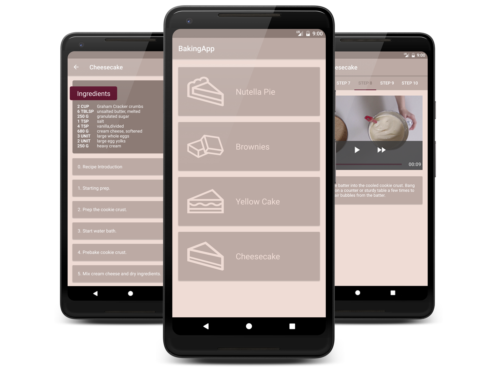

# BakingApp

*Udacity’s Android Developer Nanodegree project*  

This Android app allows users to select a recipe and see video guided steps for how to complete it.
The recipes contain instructions and ingredients but not all steps of the recipe have a video.
The Widget displays the ingredient list for the   desired recipe.

## Feature

- App uses Fragments to create a responsive design that works on phones and tablets
- App utilizes a third-party library to enhance the app's features
- App uses Exoplayer to display videos
- App makes use of Espresso to test aspects of the UI
- App has a Widget 
- App handles error cases (unexpected input in JSON data)

## Libraries

- Gson
- Picasso
- ButterKnife
- Retrofit 2
- ExoPlayer
- Espresso

## Screenshots
 

 
 
 

  

 
 
  

  

 

## License

    Copyright 2018 Attila Kasza

    Licensed under the Apache License, Version 2.0 (the "License");
    you may not use this file except in compliance with the License.
    You may obtain a copy of the License at

        http://www.apache.org/licenses/LICENSE-2.0

    Unless required by applicable law or agreed to in writing, software
    distributed under the License is distributed on an "AS IS" BASIS,
    WITHOUT WARRANTIES OR CONDITIONS OF ANY KIND, either express or implied.
    See the License for the specific language governing permissions and
    limitations under the License.
